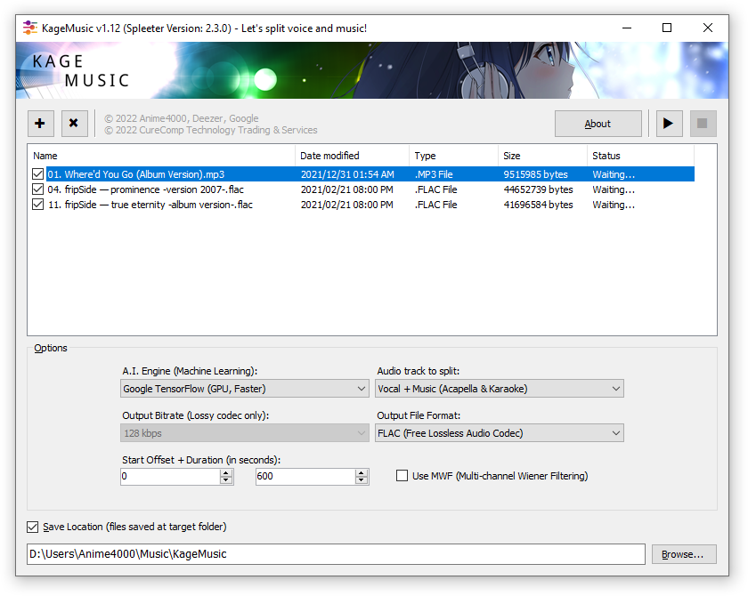

# KageMusic (Shadow Music)
KageMusic is Front End for Spleeter, self-contain.

> Another SpleeterGUI Alternative with more options and queue support

# Update Spleeter
To update Spleeter library, follow this step:

1. Open Command Prompt/Terminal (as Admins if possible)
2. `%windir%\SystemAI\spleeter\python\pycmd.cmd`
3. `pip install spleeter -U`

# Cross Platform
KageMusic can be run on Linux (Ubuntu) or macOS via Mono Runtime.

Most Linux distro have python installed, simply do `pip install spleeter`

Base code of this need to be adjust depend on platfrom.
